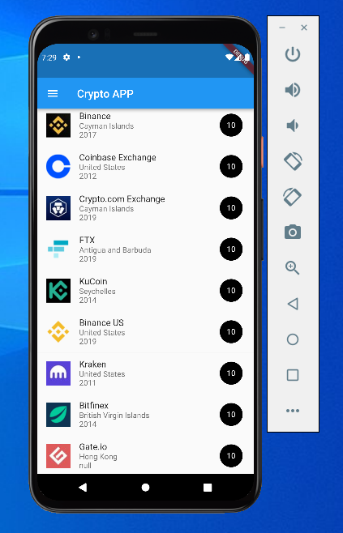
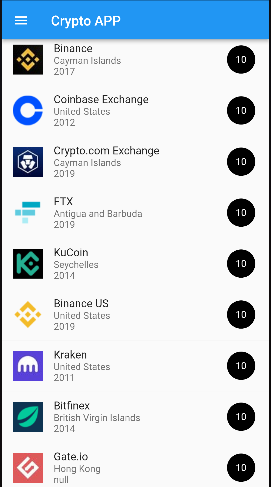

# Tarea 4: List views crypto

- Listview
- Assets
- Constrainedbox
- Objetos 

# Lo que me costo mas trabajo
- La parte de recorrer el objeto y que funcionar.

- El como limitar el tamaño de las imagenes, antes me crasheaba la aplicación por pasar del tamaño correcto.

# Lo que aprendi

- Como utilizar los list view.

- Recorrer un objeto.

